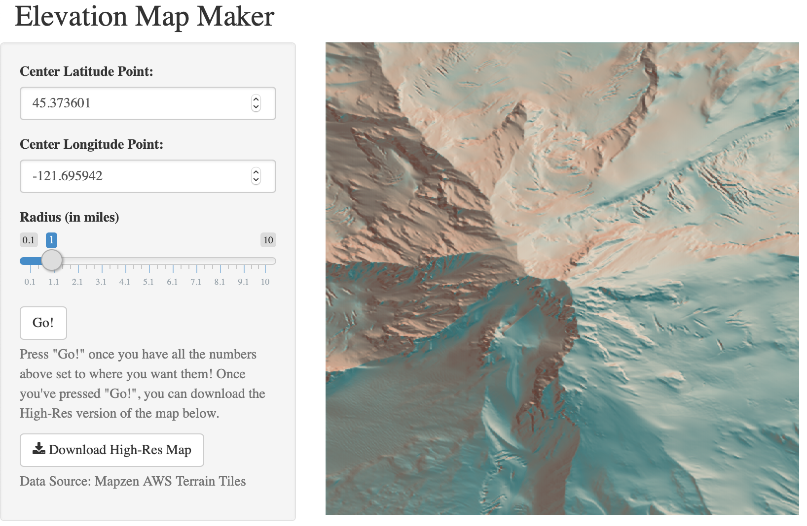

```{r setup, include=FALSE}
knitr::opts_chunk$set(echo = TRUE)
```



This repository implements a Shiny app to make an elevation plot of a surface on earth based on a lat/lon and radius given by the user using `rayshader` and `elevatr`. The above screenshot shows the apperance of the app after pressing "Go!" with default settings---an elevation plot of Mount Hood in Oregon.


*Simon P. Couch*