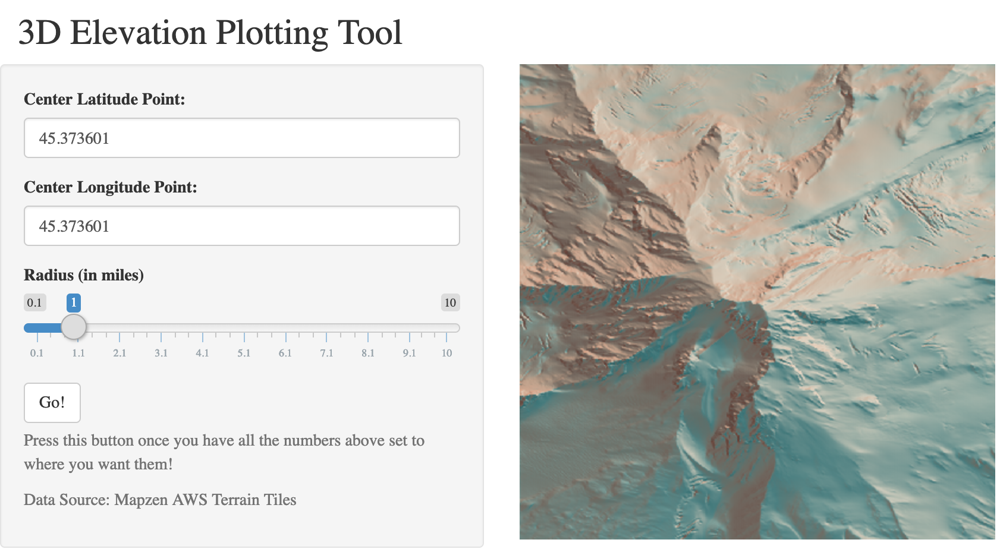

```{r setup, include=FALSE}
knitr::opts_chunk$set(echo = TRUE)
```

##### *Simon P. Couch*

This repository implements a Shiny app to make an elevation plot of a surface on earth based on a lat/lon and radius given by the user using `rayshader` and `elevatr`.


